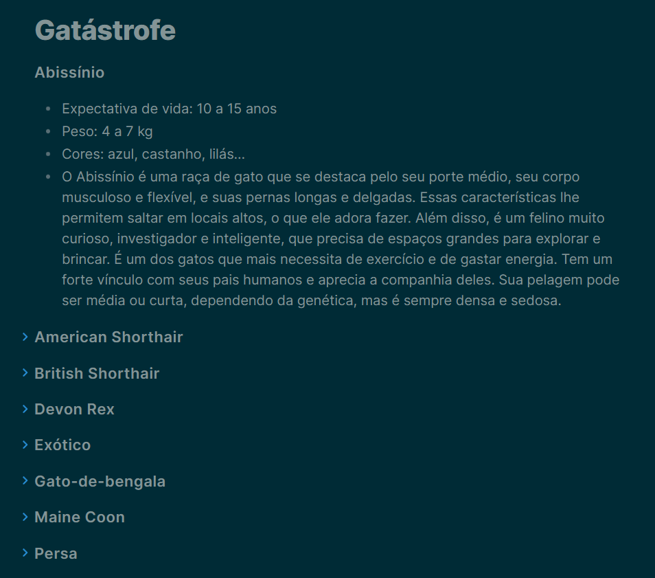
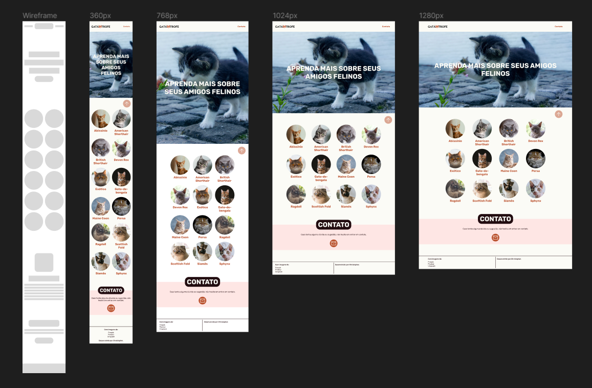

# Gatástrofe

Site desenvolvido com a finalidade de por em prática o que tenho aprendido nos últimos meses, sendo um guia rápido sobre algumas espécies de gatos. Para ver o resultado basta acessar [esse link]().

## Tecnologias

 - HTM
 - CSS/Sass
 - JavaScript

 ## Detalhes

 Iniciei o projeto como forma de praticar o conhecimento adquirido recentemente. Diferente de sites desenvolvidos em aulas, quis fazer algo que tivesse algumas funções, o que me levou a usar um pouco de JavaScript para elementos como o carrossel e overlay.

## Desenvolvimento

Com a ideia inicial já em mente, comecei a pensar na estrutura que o site teria. Busquei algumas referências, principalmente por querer desenvolver algo que possuísse apenas uma página, e fiz um rascunho do site.

Com o tema definido, iniciei o processo de pesquisa e separação de informações, juntamente com a coleta de imagens que seriam usadas.

 

Em seguida comecei a projetar [o layout]() do site no Figma. A princípio com um wireframe, depois defini algumas cores que poderia usar e fiz uma logo simples, dando prosseguimento e finalizando [o layout]() do site para alguns tamanhos de tela, escolhendo um grid de tamanho fixo para telas maiores.

 

Feito isso, dei início ao desenvolvimento em código, optando por utilizar o Sass para a estilização. Além do grid para a parte principal do site, algumas aplicações que usei incluem: efeito parallax para o banner em telas maiores, overlay para as informações e imagens, e um botão que leva de volta ao topo.